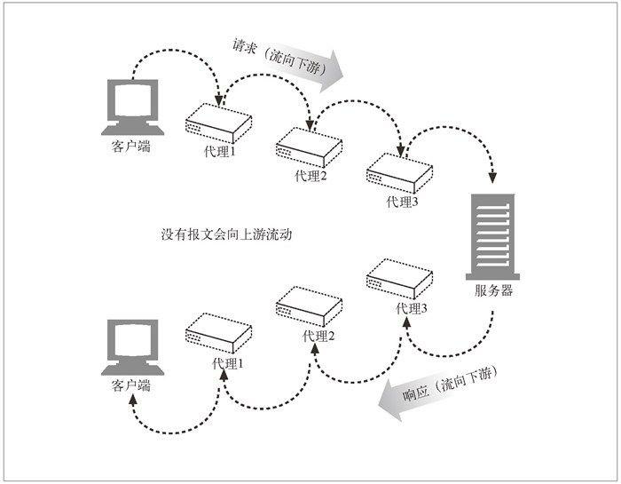

# HTTP GUIDE

分享一个专业性不是那么强的话题，可以当做听一个故事好了。
今天的主题是：我们是如何看到一个网页的？

# 我们是如何看到一个网页的

这个问题很容易回答是吧，用浏览器输入一个网址然后就能看到了，而我们将这种行为称为 🏄 网上冲浪。
没错网页通常是透过网页浏览器来阅读的，然后大部分网页又是使用 `http` 协议来传输的。

# 协议

网络协议是一组约定，为了计算机之间能正常相互通信交流而生。

我们这里列出一些应用层的协议：
- HTTP
- DNS
- FTP
- SSH
- …

在我们生活中：
> 沟通成功的关键在于：双方都是讲道理的人（就是肯遵守协议的人）。

那么我们就很容易来理解生活中的一些不和谐的婆媳关系，婚恋关系了，原因和可能在于他们之间没有制定共同的协议，或者说协议的版本差距比较大。

# HTTP 协议

`HTTP` 协议在 1989 年 3 月（互联网的黎明期）为了 `知识共享` 而规划诞生。

而我们目前在使用的 `HTTP` 协议是 1997 年 1 月公布的 `HTTP/1.1` 版本，目前最新的 `HTTP/2.0` 是基于 `SPDY` 协议设计的。
- 二进制替代文本格式（解析会更高效，错误更少）
- 报头压缩（降低开销）
- 服务端主动推送（WebSocket）

`HTTP/2.0` 没有就新协议使用加密（LTS）达成共识，不过有实现者表示只有`HTTP/2.0` 使用加密链接他们才提供支持。所以目前在 `Chrome` 和 `FF` 上 2.0 只支持 `HTTPS` 。

# MIME

MIME 类型 (Multipurpose Internet Mail Extension) 是一种文本标记，表示一种主要的对象类型和一个特定的子类型，中间由一条斜杠来分隔。

- html 文档 text/html
- jpeg 图片 image/jpeg
- gif 图片 image/gif
- ...

# URI

统一资源标识符 (Uniform Resource Identi?er)，在世界范围内唯一标识并定位信息资源。

# URL

统一资源定位符，现在，几乎所有的 `URI` 都是 `URL`

> https://wikipedia.org/wiki/Hypertext_Transfer_Protocol

一个常见的 `URL` 由三部分组成

- 协议头 （ https:// ）
- 服务器所在域因特网地址 （wikipedia.org）
- 指定服务器上的某个资源 （/wiki/Hypertext_Transfer_Protocol）

# URL 的编码机制

为了避开安全字符集带来的限制，设计了一种编码机制，用来在 `URL` 中表示各种不安全的字符。这种编码机制是通过一种“转义”表示法来表示不安全字符的，这种表示法包含一个百分号（`%`），后面跟着两个表示字符 ASCII 码的十六进制数

> https://www.baidu.com/s?wd=%E8%B0%B7%E6%AD%8C

# 代理

关于 Web 代理（Proxy） 我们首先会想到 `VPN` 这类应用。代理服务器是代表客户端完成事务处理的中间人，所以代理服务器既是 Web 服务器又是 Web 客户端。

# 报文和实体

报文是快递盒子，实体是货物。

# 浏览器
浏览器渲染过程
1. **下载** html 、css、js 等请求资源
2. **解析** html 生成 `DOM TREE`, CSS 生成 `RULE TREE` 结合生成 `rendering tree`
3. **布局**  根据渲染树计算 DOM 元素的大小和位置
4. **绘制** 渲染引擎会遍历渲染树，根据布局由用户界面后端层将每个节点绘制出来

