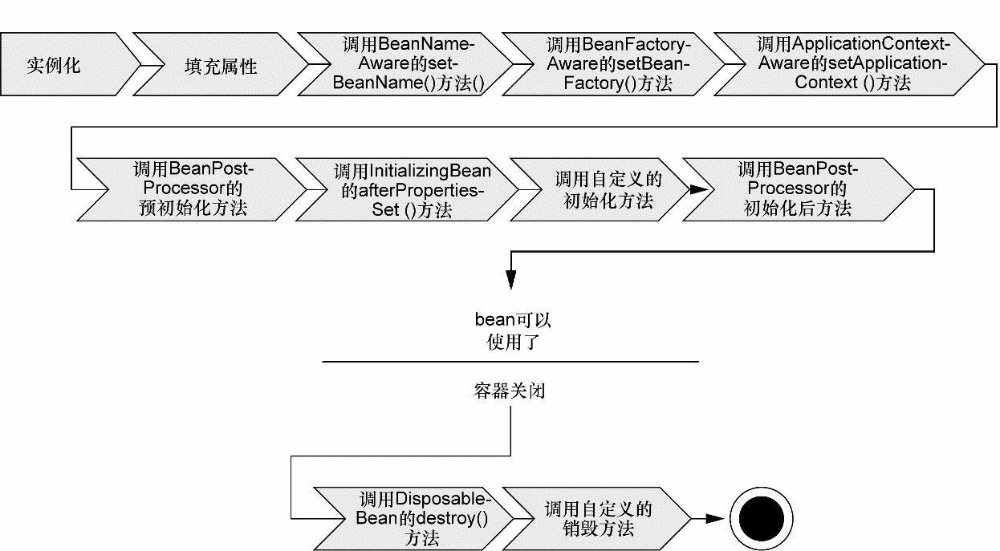
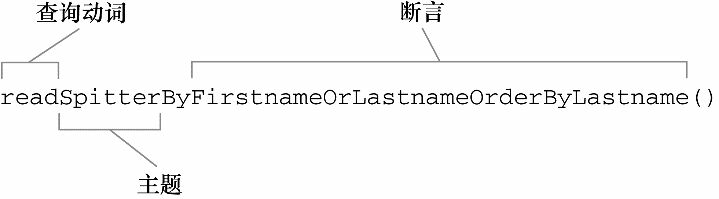

# DI

依赖注入这个词让人望而生畏，现在已经演变成一项复杂的编程技巧或设计模式理念。但事实证明，依赖注入并不像它听上去那么复杂。在项目中应用DI，你会发现你的代码会变得异常简单并且更容易理解和测试。

## DI 是如何实现的

#### 关于耦合性

耦合具有两面性（two-headed beast）。一方面，紧密耦合的代码难以测试、难以复用、难以理解，并且典型地表现出“打地鼠”式的bug特性（修复一个bug，将会出现一个或者更多新的bug）。另一方面，一定程度的耦合又是必须的——完全没有耦合的代码什么也做不了。为了完成有实际意义的功能，不同的类必须以适当的方式进行交互。总而言之，耦合是必须的，但应当被小心谨慎地管理。


#### DI 益处

DI 带来最大的益处是松耦合


#### Spring 容器（container）

Spring 容器负责创建对象，装配它们，配置它们并管理它们的整个生命周期，从生存到死亡（在这里，可能就是 new 到 finalize()）。

Spring 容器并不是只有一个。Spring 自带了多个容器实现，可以归为两种不同的类型。bean 工厂（由org.springframework.beans.factory.BeanFactory接口定义）是最简单的容器，提供基本的 DI 支持。应用上下文（由org.springframework.context.ApplicationContext接口定义）基于 BeanFactory 构建，并提供应用框架级别的服务，例如从属性文件解析文本信息以及发布应用事件给感兴趣的事件监听者。


#### 应用上下文（ApplicationContext）

- AnnotationConfigApplicationContext：从一个或多个基于 Java 的配置类中加载 Spring 应用上下文。
- AnnotationConfigWebApplicationContext：从一个或多个基于 Java 的配置类中加载 Spring Web 应用上下文。
- ClassPathXmlApplicationContext：从类路径下的一个或多个 XML 配置文件中加载上下文定义，把应用上下文的定义文件作为类资源。
- FileSystemXmlapplicationcontext：从文件系统下的一个或多个 XML 配置文件中加载上下文定义。
- XmlWebApplicationContext：从 Web 应用下的一个或多个 XML 配置文件中加载上下文定义。

有了这些上下文之后，我们可以调用上下文的 getBean() 方法从 Spring 容器中获取 bean。

在 Spring 中 bean 的生命周期：




详细的过程如下：

1．Spring对bean进行实例化；

2．Spring将值和bean的引用注入到bean对应的属性中；

3．如果bean实现了BeanNameAware接口，Spring将bean的ID传递给setBean-Name()方法；

4．如果bean实现了BeanFactoryAware接口，Spring将调用setBeanFactory()方法，将BeanFactory容器实例传入；

5．如果bean实现了ApplicationContextAware接口，Spring将调用setApplicationContext()方法，将bean所在的应用上下文的引用传入进来；

6．如果bean实现了BeanPostProcessor接口，Spring将调用它们的post-ProcessBeforeInitialization()方法；

7．如果bean实现了InitializingBean接口，Spring将调用它们的after-PropertiesSet()方法。类似地，如果bean使用init-method声明了初始化方法，该方法也会被调用；

8．如果bean实现了BeanPostProcessor接口，Spring将调用它们的post-ProcessAfterInitialization()方法；

9．此时，bean已经准备就绪，可以被应用程序使用了，它们将一直驻留在应用上下文中，直到该应用上下文被销毁；

10．如果bean实现了DisposableBean接口，Spring将调用它的destroy()接口方法。同样，如果bean使用destroy-method声明了销毁方法，该方法也会被调用。


#### 装配 Bean

创建对象之间的协作关系的行为通常称为装配（wiring）,这也是依赖注入（DI）的本质。

Spring 从两个角度实现自动化装配：

- 组件扫描（component scanning）：Spring 会自动发现应用上下文中所创建的 bean。
- 自动装配（autowiring）：Spring 自动满足 bean 之间的依赖


#### 条件化的 Bean

我们的 Bean 可能只想在某些特定的环境下被创建，比如说我们只想在生产环境下创建一个特殊的 Bean。 

在 Spring 4 之后引入了 `@Conditional` 注解

```java
@Bean
@Conditional(ProdExistsCondition.class)
public ProdBean prodBean(){
    return new ProdBean();
}
```


设置给 `@Conditional` 的类可以是任意实现了 `Condition` 接口的类型。可以看出来，这个接口实现起来很简单直接，只需提供 matches() 方法的实现即可。如果 matches() 方法返回 true，那么就会创建带有 `@Conditional` 注解的 bean。如果 matches() 方法返回 false，将不会创建这些 bean。


```java
public class ProdExistsCondition implements Condition {
    public boolean matches(ConditionContext ctx, AnnotatedTypeMetadata metadata) {
        Environment env = ctx.getEnvironment();
        return env.containsProperty("prod");
    }
}
```


#### 优先选择的 Bean

我们都知道面向接口编程，就像我们 MVC 三层结构中 Controller 中注入一个 Service， 而这个 Service 的接口存在多个实现类时，Spring 会报 `NoUniqueBeanDefinitionException` 异常。因为 Spring 无法自主的去选择一个合适的实现类。这时我们需要给 Spring 提供帮助，让他能够找到合适的首选（primary）的 Bean。

```java
@Component
@Primary
public class IceCream implements Dessert { ... }
```


#### Bean 的作用域

在默认情况下，Spring 应用上下文中所有 bean 都是作为以单例（singleton）的形式创建的。也就是说，不管给定的一个 bean 被注入到其他 bean 多少次，每次所注入的都是同一个实例。

Spring 定义了多种作用域，缺省值是 Singleton。

- 单例（Singleton）：在整个应用中，只创建bean的一个实例。
- 原型（Prototype）：每次注入或者通过Spring应用上下文获取的时候，都会创建一个新的bean实例。
- 会话（Session）：在Web应用中，为每个会话创建一个bean实例。
- 请求（Rquest）：在Web应用中，为每个请求创建一个bean实例。

我们知道了 Spring 容器中的 Bean 默认是单例的，但是对于易变的类型而言，这并不合适，我们需要使用使用`@Scope` 注解来配置，它可以与 `@Component` 或 `@Bean` 一起使用。


```java
@Component
@Scope(ConfigurableBeanFactory.SCOPE_PROTOTYPE)
public class Notepad { ... }
```


#### Spring 表达式

Spring Expression Language，SpEL

```java
@Value("#{T(System).currentTimeMillis()}")
```


# JPA

Spring Data能够让我们只编写Repository接口就可以了。根本就不再需要实现类了。

我们需要将我们的 Repository（DAO 层） 扩展 Spring Data JPA 的 `JpaRepository` 接口

```java
public interface UserDao
       extends JpaRepository<User, Long> {
    User findByUsername(String username);
}
```


findByUsername() 方法非常简单，但是 Spring Data 也能处理更加有意思的方法名称。Repository 方法是由一个动词、一个可选的主题（Subject）、关键词By以及一个断言所组成。在 findByUsername() 这个样例中，动词是find，断言是 Username，主题并没有指定，暗含的主题是 User。

作为编写 Repository 方法名称的样例，我们参照名为 readUserByUsernameOrDisplayname() 的方法，看一下方法中的各个部分是如何映射的。图11.1展现了这个方法是如何拆分的。

我们可以看到，这里的动词是 read，与之前样例中的find有所差别。Spring Data 允许在方法名中使用四种动词：get、read、find 和 count。其中，动词 get、read 和 find 是同义的，这三个动词对应的 Repository 方法都会查询数据并返回对象。而动词 count 则会返回匹配对象的数量，而不是对象本身。




在断言中，会有一个或多个限制结果的条件。每个条件必须引用一个属性，并且还可以指定一种比较操作。如果省略比较操作符的话，那么这暗指是一种相等比较操作。不过，我们也可以选择其他的比较操作，包括如下的种类：

- IsAfter、After、IsGreaterThan、GreaterThan
- IsGreaterThanEqual、GreaterThanEqual
- IsBefore、Before、IsLessThan、LessThan
- IsLessThanEqual、LessThanEqual
- IsBetween、Between
- IsNull、Null
- IsNotNull、NotNull
- IsIn、In
- IsNotIn、NotIn
- IsStartingWith、StartingWith、StartsWith
- IsEndingWith、EndingWith、EndsWith
- IsContaining、Containing、Contains
- IsLike、Like
- IsNotLike、NotLike
- IsTrue、True
- IsFalse、False
- Is、Equals
- IsNot、Not

看到这么多的断言贯彻了约定大于配置的思想，这里列出来的断言也只是一部分。

如果所需的数据无法通过方法名称进行恰当地描述，那么我们可以使用@Query注解，为Spring Data提供要执行的查询。对于findAllGmailSpitters()方法，我们可以按照如下的方式来使用@Query注解：

```java
@Query("select s from Spitter s where s.email like '%gmail.com'")
List<Spitter> findAllGmailSpitters();
```


# REST

为了理解REST是什么，我们将它的首字母缩写拆分为不同的构成部分：

- 表述性（Representational）：REST资源实际上可以用各种形式来进行表述，包括XML、JSON（JavaScript Object Notation）甚至HTML——最适合资源使用者的任意形式；
- 状态（State）：当使用REST的时候，我们更关注资源的状态而不是对资源采取的行为；
- 转移（Transfer）：REST涉及到转移资源数据，它以某种表述性形式从一个应用转移到另一个应用。


在REST中，资源通过URL进行识别和定位。至于RESTful URL的结构并没有严格的规则，但是URL应该能够识别资源，而不是简单的发一条命令到服务器上。再次强调，关注的核心是事物，而不是行为。

REST中会有行为，它们是通过HTTP方法来定义的。具体来讲，也就是GET、POST、PUT、DELETE、PATCH以及其他的HTTP方法构成了REST中的动作。这些HTTP方法通常会匹配为如下的CRUD动作：

- Create：POST
- Read：GET
- Update：PUT或PATCH
- Delete：DELETE


# Spring Email

Spring Email 抽象的核心是 `MailSender` 接口


SpringBoot 中需要添加 spring-boot-starter-mail 这个 `starter`

```xml
<dependency>

	<groupId>org.springframework.boot</groupId>

	<artifactId>spring-boot-starter-mail</artifactId>

</dependency>

```


接着配置邮件相关的账户密码

```yaml
  # email
  spring:
      mail:
        host: smtp.163.com
        username: 13227379709@163.com
        password: abcd1234
        properties:
          mail:
            smtp:
              auth: true
            starttls:
              enable: true
              required: true
```

使用 `JavaMailSender`（`JavaMailSender` 继承自 `MailSender` 接口） 发送一封邮件

```java
	@Autowired
    private JavaMailSender sender;
    
    @GetMapping("/send")
    public String sendMail(){
        SimpleMailMessage message = new SimpleMailMessage();
        message.setFrom("13227379709@163.com");
        message.setTo("784516419@qq.com");
        message.setSubject("主题");
        message.setText("这是内容");
        sender.send(message);
        return "ok";
    }
```

