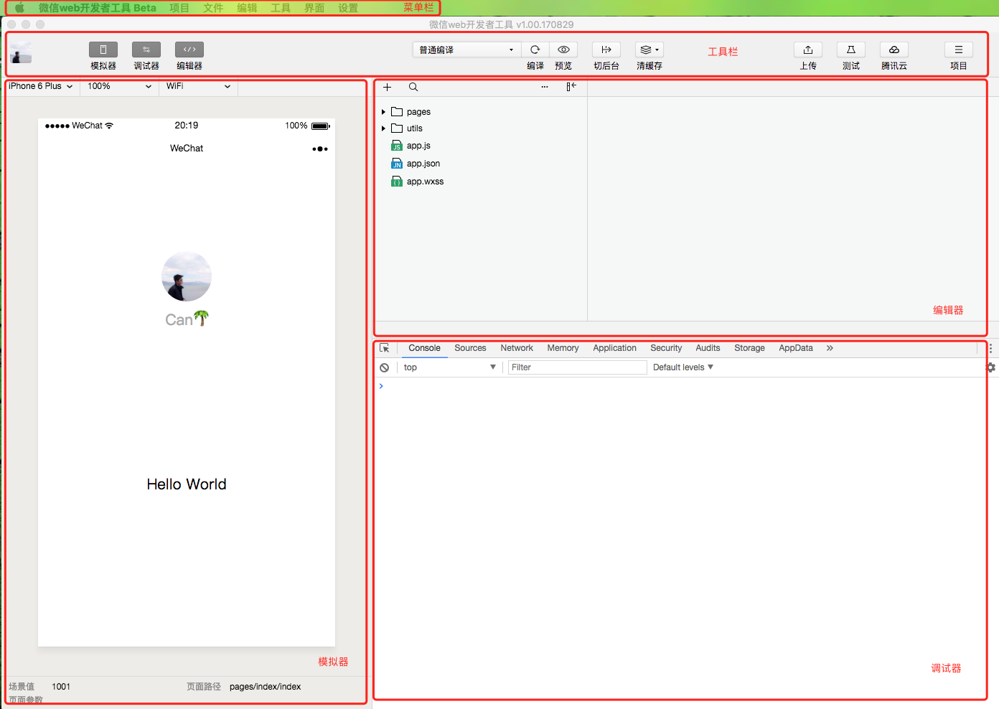

# 小程序开发

#### 资料来源

整理自微信公众平台小程序开发文档: https://developers.weixin.qq.com/miniprogram/dev/

#### 小程序中的文件类型 & 文件结构

1. `.json`  JSON 配置文件
2. `.wxml` WXML 模板文件
3. `.wxss` WXSS 样式文件
4. `.js` JS 脚本逻辑文件


小程序包含一个描述整体程序的 `app` 和多个描述各自页面的 `page`。 

一个小程序主体部分由三个文件组成，必须放在项目的根目录，如下：

| 文件                                                         | 必需 | 作用             |
| ------------------------------------------------------------ | ---- | ---------------- |
| [app.js](https://developers.weixin.qq.com/miniprogram/dev/framework/app-service/app.html) | 是   | 小程序逻辑       |
| [app.json](https://developers.weixin.qq.com/miniprogram/dev/framework/config.html) | 是   | 小程序公共配置   |
| [app.wxss](https://developers.weixin.qq.com/miniprogram/dev/framework/view/wxss.html) | 否   | 小程序公共样式表 |

一个小程序页面由四个文件组成，分别是：

| 文件类型                                                     | 必需 | 作用       |
| ------------------------------------------------------------ | ---- | ---------- |
| [js](https://developers.weixin.qq.com/miniprogram/dev/framework/app-service/page.html) | 是   | 页面逻辑   |
| [wxml](https://developers.weixin.qq.com/miniprogram/dev/framework/view/wxml/index.html) | 是   | 页面结构   |
| [json](https://developers.weixin.qq.com/miniprogram/dev/framework/config.html#%E9%A1%B5%E9%9D%A2%E9%85%8D%E7%BD%AE) | 否   | 页面配置   |
| [wxss](https://developers.weixin.qq.com/miniprogram/dev/framework/view/wxss.html) | 否   | 页面样式表 |

**注意：为了方便开发者减少配置项，描述页面的四个文件必须具有相同的路径与文件名。**

> 一个小程序页面（`wxml` + `js` + `wxss`）相当于我们熟悉的 Vue 里面的 `<template>` + `<script>` + `<style>`

#### 程序入口 App.js

`App(Object obj)` 函数用于注册小程序，接受一个 Object 参数，可以在 obj 里指定小程序的生命周期函数

```javascript
App({
  onLaunch: function(options) {
    // 生命周期函数--监听小程序初始化
  },
  onShow: function(options) {
  	// 生命周期函数--监听小程序显示
  },
  onHide: function() {
  	// 生命周期函数--监听小程序隐藏
  },
  onError: function(msg) {
    // 错误监听函数
    console.log(msg)
  },
  onPageNotFound: function(res) {
    // 页面不存在监听函数
	console.log(res)
  }
})
```


#### 注册页面 Page

Page 即是小程序中的页面，所有的页面需要在 app.json 的 `"pages"` 数组中注册，和 `App()` 注册小程序一样，页面注册使用 `Page(Object obj)` 函数来注册一个页面。接受一个 Object 参数，在 obj 中指定初始数据、生命周期函数、以及事件处理函数。

```js
Page({
  data: {
  	// 初始数据
    text: "This is page data."
  },
  onLoad: function(options) {
    // 生命周期回调—监听页面加载
  },
  onReady: function() {
    // 生命周期回调—监听页面初次渲染完成
  },
  onShow: function() {
    // 生命周期回调—监听页面显示
  },
  onHide: function() {
    // 生命周期回调—监听页面隐藏
  },
  onUnload: function() {
    // 生命周期回调—监听页面卸载
  },
  onPullDownRefresh: function() {
    // 监听用户下拉动作
  },
  onReachBottom: function() {
    // 页面上拉触底事件的处理函数
  },
  onShareAppMessage: function () {
    // 用户点击右上角转发
  },
  onPageScroll: function() {
    // 页面滚动触发事件的处理函数
  },
  onTabItemTap(item) {
    // 当前是 tab 页时，点击 tab 时触发
  }
})
```

**Page 的生命周期图**


#### 页面栈 & 路由

`getCurrentPages()` 函数用于获取当前页面栈的实例，以数组形式按栈的顺序给出，第一个元素为首页，最后一个元素为当前页面。 

打开新页面与重定向：

- 打开新页面：[`wx.navigateTo`](https://developers.weixin.qq.com/miniprogram/dev/api/ui-navigate.html#wxnavigatetoobject) 
- 重定向：[`wx.redirectTo`](https://developers.weixin.qq.com/miniprogram/dev/api/ui-navigate.html#wxredirecttoobject) 
- 页面返回：[`wx.navigateBack`](https://developers.weixin.qq.com/miniprogram/dev/api/ui-navigate.html#wxnavigateback) 
- Tab 切换：[`wx.switchTab`](https://developers.weixin.qq.com/miniprogram/dev/api/ui-navigate.html#wxswitchtab) 
- 重启动：[`wx.reLaunch`](https://developers.weixin.qq.com/miniprogram/dev/api/ui-navigate.html#wxrelaunch) 


#### 视图

和我们熟悉的前端框架（`Vue`）类似，双向数据绑定，在小程序里所有视图上的数据都是绑定在 Page 里的 data 对象中。

```xml
<!--wxml-->
<view> {{ message }} </view>
```

```js
// page.js
Page({
  data: {
    message: 'Hello MINA!'
  }
})
```

**wx:if**

```xml
<view wx:if="{{condition}}"> {{content}} </view>
```

```js
Page({
  data: {
    condition: true,
    content: 'Hello.'
  }
})
```

**wx:for**

```xml
<view wx:for="{{array}}">
  {{index}}: {{item.message}}
</view>
```

```js
Page({
  data: {
    array: [{
      message: 'foo',
    }, {
      message: 'bar'
    }]
  }
})
```


#### 组件

提供视图层的基本组成单元，组件自带一些功能与微信风格的样式。

https://developers.weixin.qq.com/miniprogram/dev/component/


#### API

由微信提供的能力，如获取用户信息，本地存储，位置信息，支付功能等。 

https://developers.weixin.qq.com/miniprogram/dev/api/


#### 开发工具




微信官方有提供开发调试微信小程序的工具。


#### 其他

使用 `Vue` 开发小程序：https://github.com/Meituan-Dianping/mpvue

由美团技术团队开发并开源， `美团火车票12306抢票`、`美团汽车票` 和 `美团充电` 


## 接入小程序登录（获取 openId）


登录流程：

