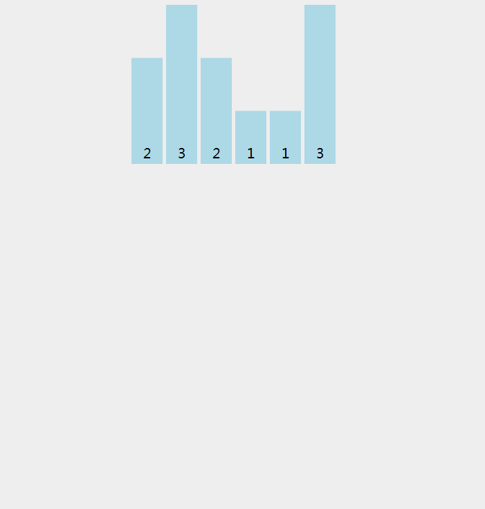

# 【图解算法】排序算法——计数排序

### 问题

首先我们一起来看一道 `LeetCode` 上的算法题目，[Sort Colors](https://leetcode-cn.com/problems/sort-colors/description/) 来自微软和 Facebook 的一道面试题。


> 给定一个包含红色、白色和蓝色，一共 *n* 个元素的数组，**原地**对它们进行排序，使得相同颜色的元素相邻，并按照红色、白色、蓝色顺序排列。
>
> 此题中，我们使用整数 0、 1 和 2 分别表示红色、白色和蓝色。
>
> **注意:**
> 不能使用代码库中的排序函数来解决这道题
>
> **示例:** 
>
> ```
> 输入: [2,0,2,1,1,0]
> 输出: [0,0,1,1,2,2]
> ```


如果是你在面试中遇到这道问题，你会怎么来解呢？我们当然可以在不利用特定条件（只有红色、白色和蓝色）下使用一个快速排序来解决这道问题。算法通常要先可解（暴力手段）再优化（更低的时间复杂度和空间复杂度）。


### 思考

由于这个问题中元素的种类较少（此题中只有三种元素），那么我们可以考虑先为这些元素计数。之后再来根据计数来输出结果。


### 解题

```java
class Solution {
    public void sortColors(int[] nums) {
        int [] count = new int[3]; // count[0] 记录 0 出现的次数 count[1] => 1的次数 count[2] => 2 的次数
        for (int i = 0; i < nums.length; i++) {
            if(nums[i] == 0)
                count[0]++;
            else if(nums[i] == 1)
                count[1]++;
            else
                count[2]++;
        }

        int idx = 0;
        for (int i = 0; i < count.length; i++) {
            for (int j = 0; j < count[i]; j++) {
                nums[idx] = i;
                idx++;
            }
        }
    }
}
```


### 输出

> ```
> [0,0,1,1,2,2]
> ```


### 图示




### 图解算法目录


[【图解算法】排序算法——冒泡排序、选择排序](http://blog.csdn.net/xiaoping0915/article/details/72615195)

[【图解算法】排序算法——插入排序](http://blog.csdn.net/xiaoping0915/article/details/72949784)

[【图解算法】排序算法——归并排序](http://blog.csdn.net/xiaoping0915/article/details/73149536)

[【图解算法】排序算法——快速排序](http://blog.csdn.net/xiaoping0915/article/details/73193006)

[【图解算法】Java GC算法](http://blog.csdn.net/xiaoping0915/article/details/69525632)

[【图解算法】排序算法——堆排序](http://blog.csdn.net/xiaoping0915/article/details/79322609)

[【图解算法】并查集 —— 联合查找算法](http://blog.csdn.net/xiaoping0915/article/details/79727603)

Gif Power By [https://visualgo.net](https://visualgo.net)

