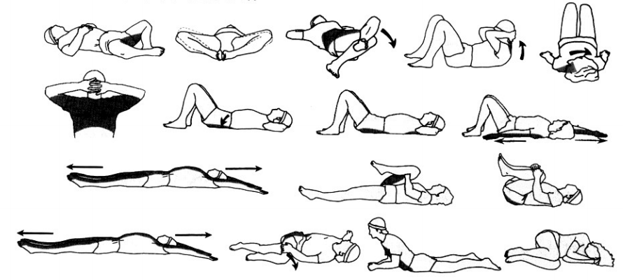
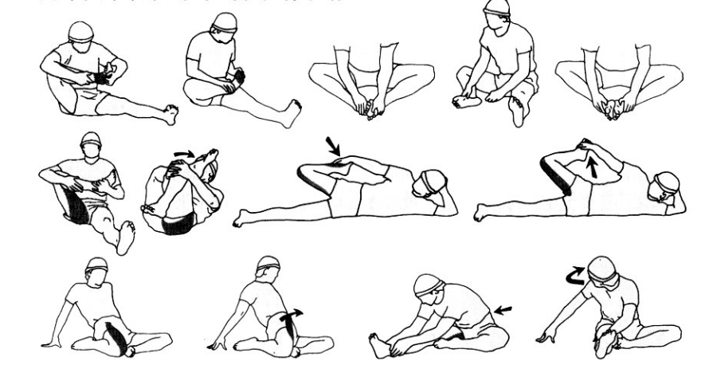
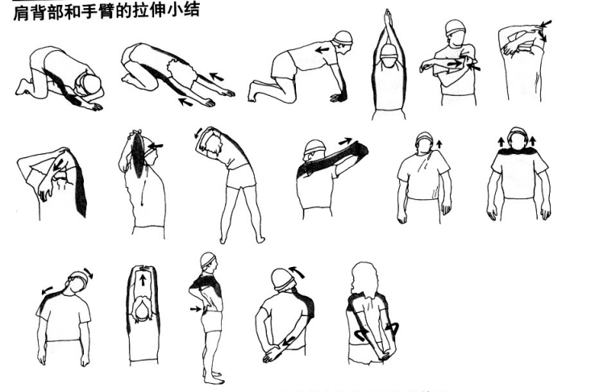
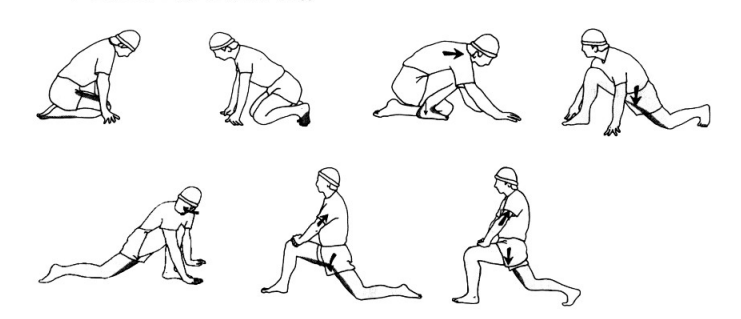
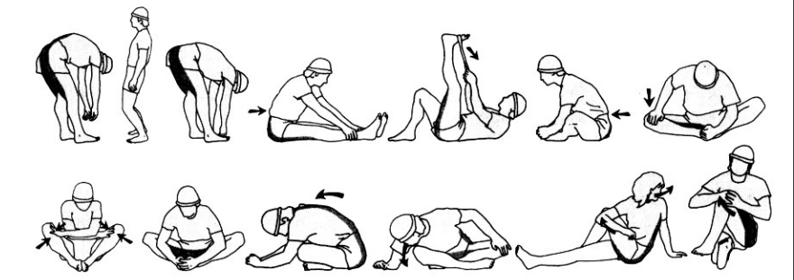
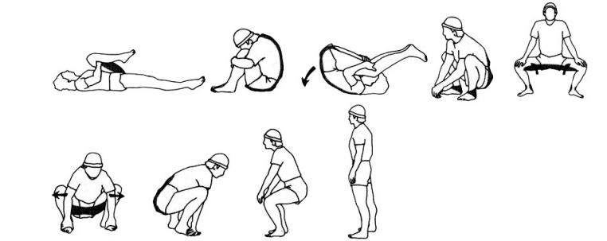
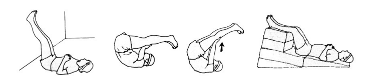

# 拉伸（What）

拉伸不会令人感到压力，他是一项自然、放松、非竞争性的运动。

# 谁需要拉伸（Who）

任何人

# 何时拉伸（When）

任何时候

# 为什么要拉伸（Why）

- 放松、放松、放松，缓解肌肉紧张
- 提高身体的协调性
- 扩大身体的动作范围
- 预防肌肉扭伤等运动损伤
- 让其他的运动变得更容易，如跑步、网球、骑自行车等
- 保持柔韧度
- 让你感觉好极了

# 如何拉伸（How）

- 牵张反射（stretch reflex myotatic reflex）:

> 肌肉依赖一种“牵张反射”的机制进行自我保护，只要你过度拉伸肌肉纤维，神经就会发射信号使肌肉收缩，防止肌肉收到损伤。

- 什么是一个“好的拉伸”：

```
轻松拉伸（5s~15s）-> 进阶拉伸（5s~15s）-> 猛烈拉伸（不要这么做，因为：有痛苦就没有收获）
```

- 拉伸入门动作技术总结，请跟着自己身体的感觉拉伸，不必拉伸到图例中的程度


# 背部和腰部的卧位拉伸



# 腿部和脚步的卧位拉伸



# PNF技术：

```
收缩 -> 放松 -> 拉伸
```

# 肩背部和手臂的拉伸



# 腿部的跪坐和跨步位拉伸



# 大腿后腱的拉伸



# 腿背部的拉伸



# 抬升双腿的拉伸

